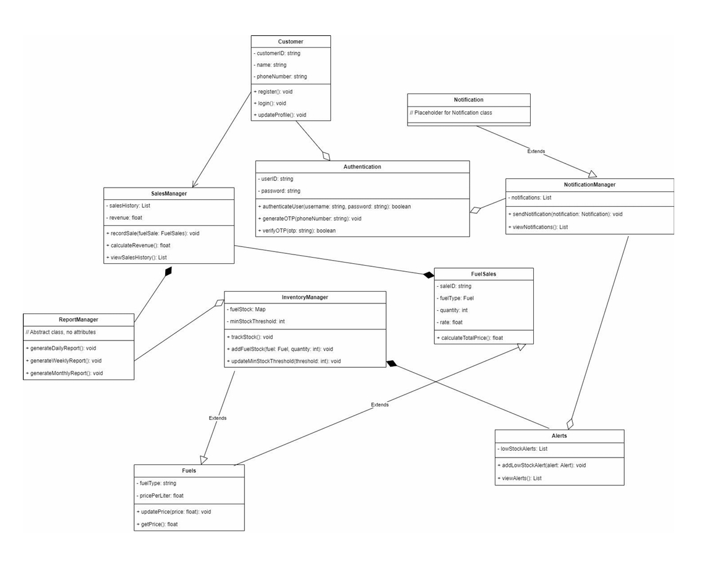
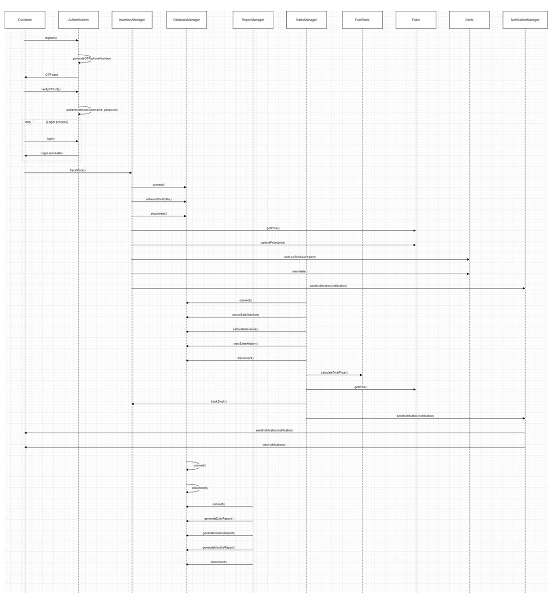

# Petrol Pump Management System

A comprehensive Petrol Pump Management System designed to streamline fuel sales transactions, inventory management, reporting, and customer notifications.

---

## 📌 Overview

The Petrol Pump Management System is developed to enhance operational efficiency, security, and decision-making in fuel station management.  
It automates various day-to-day operations such as fuel sales tracking, real-time inventory monitoring, report generation, and customer notification management.

The system is designed with a modular architecture to ensure scalability, security, and ease of maintenance.

---

## 🚀 Features

- User Registration and Authentication
- Fuel Sales Transaction Management
- Real-Time Inventory Monitoring
- Low Stock Alerts
- Automated Sales Reporting
- Notification System for Updates and Promotions
- Modular and Scalable System Design

---

## 🧩 System Modules

- **Customer Module**  
  Handles user registration, login, and profile management.

- **Authentication Module**  
  Ensures secure login using OTP/password verification.

- **Sales Module**  
  Manages fuel purchase transactions and updates inventory.

- **Inventory Module**  
  Tracks fuel stock levels and generates alerts for low stock.

- **Report Module**  
  Generates daily, weekly, and monthly sales and inventory reports.

- **Notification Module**  
  Sends system notifications regarding updates and alerts.

---

## 🛠️ Technologies Used

- Java
- Object-Oriented Programming (OOP)
- Database Management System
- Modular System Design

---

## 📊 System Architecture

### Class Diagram

### Sequence Diagram

---

## 📄 Project Report

The complete project documentation is available here:  
[Petrol_Pump_Management_System_Report.pdf](PetrolPumpManagementSystemReport.pdf)

---

## 🔮 Future Enhancements

- Mobile Application Integration  
- Advanced Business Analytics  
- IoT-Based Fuel Monitoring  
- Customer Loyalty Program

---

## 📈 Applications

- Fuel Station Management  
- Inventory Tracking Systems  
- Retail Sales Monitoring  
- Automated Reporting Systems
